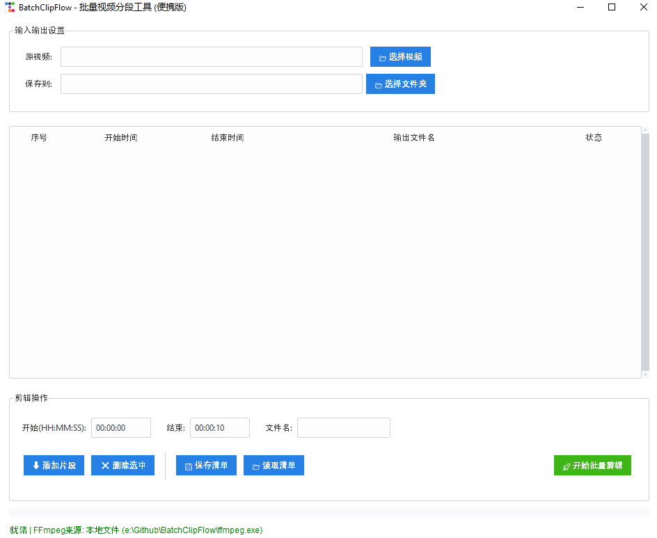

# BatchClipFlow - 批量视频分段工具

## 软件主界面



## 项目结构

```
BatchClipFlow/
├── main.py                # 主程序
├── build.py               # 打包脚本
├── requirements.txt       # 依赖列表
├── ffmpeg.exe             # 需要手动放入（见下）
├── app_config.json        # 自动生成的配置文件
└── README.md              # 本说明
```

## 1. 安装环境

确保已安装 Python 3.8+。

安装依赖：

```
pip install -r requirements.txt
```

## 2. 获取 FFmpeg（release版本的压缩包里已经包含有FFmpeg.exe）

程序依赖 FFmpeg 执行视频分段，请手动下载：

* FFmpeg 官方下载： [https://ffmpeg.org/download.html](https://ffmpeg.org/download.html)
* Windows 常用预编译版本：

  * [https://www.gyan.dev/ffmpeg/builds/](https://www.gyan.dev/ffmpeg/builds/)
  * [https://github.com/BtbN/FFmpeg-Builds](https://github.com/BtbN/FFmpeg-Builds)

下载后将 `ffmpeg.exe` 放入软件同目录（与 main.py 同层）。

## 3. 运行程序

```
python main.py
```

导入视频 → 设置分段 → 导出即可。

## 4. 打包程序

```
python build.py
```

